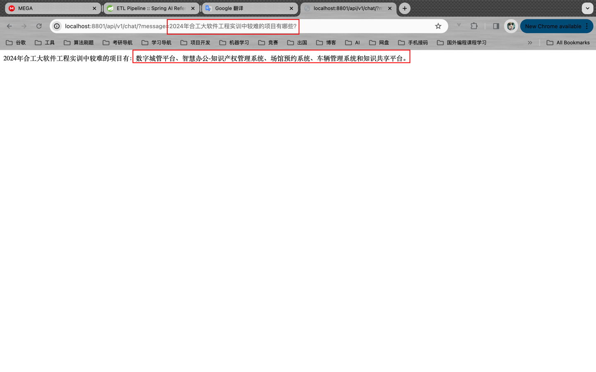
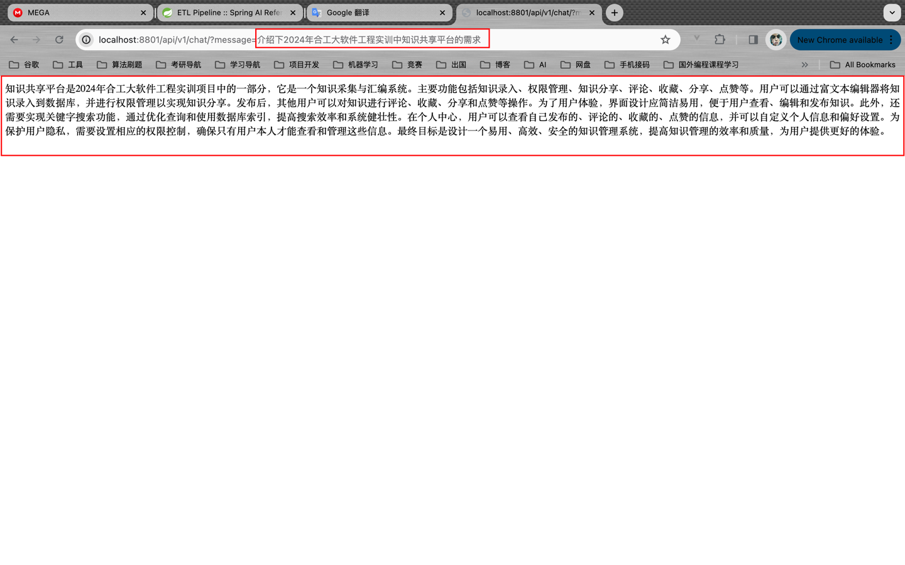
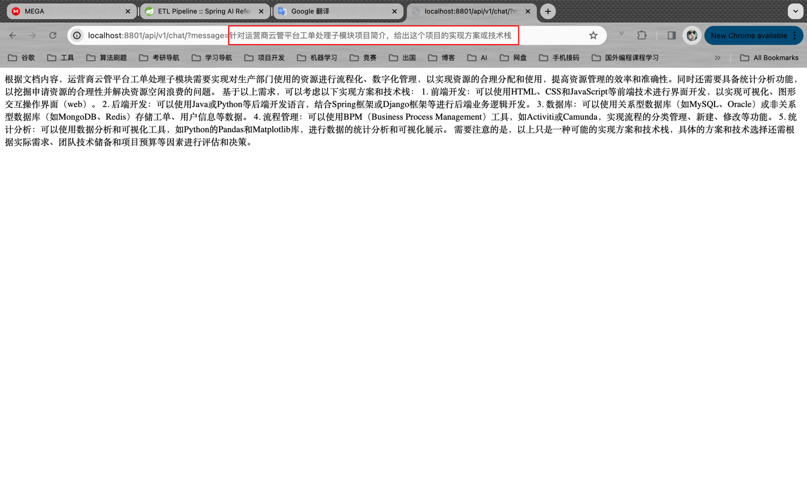

&emsp;这是Spring AI的使用demo，使用Postgresql作为向量数据库。

## 介绍

- 将PDF内容向量化并保存在向量数据库中，本Demo使用的是Postgresql；
- 调用对话前根据问题从向量数据库中检索最相似的几条记录；
- 封装数据，一并返回给大语言模型
- 大语言模型根据上下文数据进行回复

## 效果图

&emsp;以24年合工大软工实训的pdf文件为例，通过向chatgpt提问与文档内容相关的问题。

