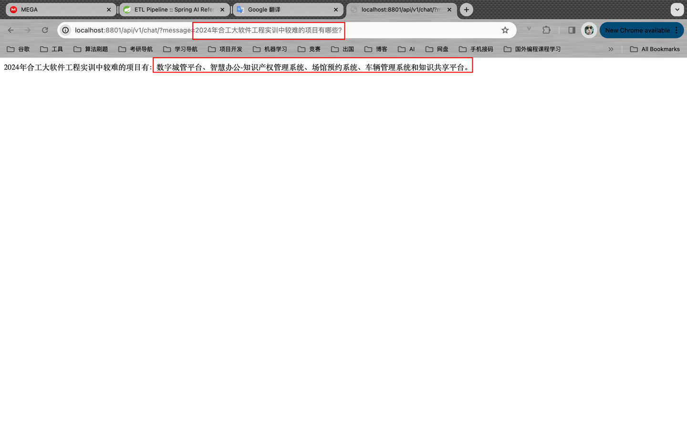

# Spring AI - 使用向量数据库实现检索式AI对话

&emsp;[Spring AI](https://docs.spring.io/spring-ai/reference/) 并不仅限于针对大语言模型对话API进行了统一封装，它还可以通过简单的方式实现[LangChain](https://github.com/langchain-ai/langchain)的一些功能。本篇将带领读者实现一个简单的检索式AI对话接口。

## 一、需求背景

&emsp;在一些场景下，我们想让AI根据我们提供的数据进行回复。因为对话有最大Token的限制，因此很多场景下我们是无法直接将所有的数据发给AI的，一方面在数据量很大的情况下，会突破Token的限制，另一方面，在不突破Token限制的情况下也会有不必要的对话费用开销。因此我们如何在花费最少费用的同时又能让AI更好的根据我们提供的数据进行回复是一个非常关键的问题。针对这一问题，我们可以采用数据向量化的方式来解决。

## 二、实现原理

将我们个人数据存储到向量数据库中。然后，在用户想AI发起对话之前，首先从向量数据库中检索一组相似的文档。然后，将这些文档作为用户问题的上下文，并与用户的对话一起发送到 AI 模型，从而实现精确性的回复。这种方式称为`检索增强生成(RAG)。

### 第一步：数据向量化

&emsp;我们有很多种方式将数据向量化，最简单的就是通过调用第三方API来实现。以OpenAI的API为例，它提供了`
https://api.openai.com/v1/embeddings` 接口，通过请求该接口可以获取某段文本的向量化的数据。具体可参考官方API介绍：[Create embeddings](https://platform.openai.com/docs/api-reference/embeddings/create)。在Spring AI中，我们不必调用该接口手动进行向量化处理，在存储到向量数据库的时候，Spring AI会自动调用的。


### 第二步：向量存储及检索

&emsp;在Spring AI中有一个`VectorStore`抽象接口，该接口定义了Spring AI与向量数据库的交互操作，我们只需通过简单的向量数据库的配置即可使用该接口对向量数据库进行操作。

```java
public interface VectorStore {

    void add(List<Document> documents);

    Optional<Boolean> delete(List<String> idList);

    List<Document> similaritySearch(String query);

    List<Document> similaritySearch(SearchRequest request);
}
```

> &emsp;向量数据库（Vector Database）是一种特殊类型的数据库，在人工智能应用中发挥着重要作用。在向量数据库中，查询操作与传统的关系数据库不同。它们是执行相似性搜索，而不是精确匹配。当给定向量作为查询时，向量数据库返回与查询向量“相似”的向量。通过这种方式，我们就能将个人的数据与AI模型进行集成。`
> 
> &emsp;常见的向量数据库有：[`Chroma`](https://www.trychroma.com/)、[`Milvus`](https://milvus.io/)、[`Pgvector`](https://github.com/pgvector/pgvector)、[`Redis`](https://redis.io/)、[`Neo4j`](https://neo4j.com/)等。


## 三、代码实现

&emsp;本篇将实现基于ChatGPT的RAG和上传PDF文件存储至向量数据库的接口，向量数据库使用`Pgvector`。Pgvector是基于PostgreSQL进行的扩展，可以存储和检索机器学习过程中生成的embeddings。

> 源码已上传至GitHub: [https://github.com/NingNing0111/vector-database-demo](https://github.com/NingNing0111/vector-database-demo)

### 版本信息

- JDK >= 17
- Spring Boot >= 3.2.2
- Spring AI = 0.8.0-SNAPSHOT

### 1. 安装Pgvector

&emsp;Pgvector将使用Docker安装。`docker-compose.yml`文件如下：

```yml
version: '3.7'
services:
  postgres:
    image: ankane/pgvector:v0.5.0
    restart: always
    environment:
      - POSTGRES_USER=postgres
      - POSTGRES_PASSWORD=postgres
      - POSTGRES_DB=vector_store
      - PGPASSWORD=postgres
    logging:
      options:
        max-size: 10m
        max-file: "3"
    ports:
      - '5432:5432'
    healthcheck:
      test: "pg_isready -U postgres -d vector_store"
      interval: 2s
      timeout: 20s
      retries: 10
```

### 2. 创建Spring项目，添加依赖

&emsp;Spring 项目的创建过程略，`pom.xml`核心内容如下：

```xml
	<properties>
		<java.version>17</java.version>
        <!--  Spring AI的版本信息  -->
		<spring-ai.version>0.8.0-SNAPSHOT</spring-ai.version>
	</properties>

	<dependencies>
		<dependency>
			<groupId>org.springframework.boot</groupId>
			<artifactId>spring-boot-starter-jdbc</artifactId>
		</dependency>

		<!-- 使用OpenAI -->
		<dependency>
			<groupId>org.springframework.ai</groupId>
			<artifactId>spring-ai-openai-spring-boot-starter</artifactId>
			<version>${spring-ai.version}</version>
		</dependency>
		<!-- 使用PGVector作为向量数据库 -->
		<dependency>
			<groupId>org.springframework.ai</groupId>
			<artifactId>spring-ai-pgvector-store-spring-boot-starter</artifactId>
			<version>${spring-ai.version}</version>
		</dependency>
		<!-- 引入PDF解析器 -->
		<dependency>
			<groupId>org.springframework.ai</groupId>
			<artifactId>spring-ai-pdf-document-reader</artifactId>
			<version>${spring-ai.version}</version>
		</dependency>
	</dependencies>

	<repositories>
		<repository>
			<id>spring-milestones</id>
			<name>Spring Milestones</name>
			<url>https://repo.spring.io/milestone</url>
			<snapshots>
				<enabled>false</enabled>
			</snapshots>
		</repository>
		<repository>
			<id>spring-snapshots</id>
			<name>Spring Snapshots</name>
			<url>https://repo.spring.io/snapshot</url>
			<releases>
				<enabled>false</enabled>
			</releases>
		</repository>
	</repositories>
```

### 3. 配置API、Key、PGVector连接信息

```yaml
server:
  port: 8801

spring:
  ai:
    openai:
      base-url: https://api.example.com
      api-key: sk-aec103e6cfxxxxxxxxxxxxxxxxxxxxxxx71da57a

  datasource:
    username: postgres
    password: postgres
    url: jdbc:postgresql://localhost/vector_store

```

### 4. 创建VectorStore和文本分割器TokenTextSplitter

&emsp;这里我创建了一个`ApplicationConfig`配置类

```java
package com.ningning0111.vectordatabasedemo.config;

import org.springframework.ai.embedding.EmbeddingClient;
import org.springframework.ai.transformer.splitter.TokenTextSplitter;
import org.springframework.ai.vectorstore.PgVectorStore;
import org.springframework.ai.vectorstore.VectorStore;
import org.springframework.context.annotation.Bean;
import org.springframework.context.annotation.Configuration;
import org.springframework.jdbc.core.JdbcTemplate;

@Configuration
public class ApplicationConfig {

    /**
     * 向量数据库进行检索操作
     * @param embeddingClient
     * @param jdbcTemplate
     * @return
     */
    @Bean
    public VectorStore vectorStore(EmbeddingClient embeddingClient, JdbcTemplate jdbcTemplate){
        return new PgVectorStore(jdbcTemplate,embeddingClient);
    }

    /**
     * 文本分割器
     * @return
     */
    @Bean
    public TokenTextSplitter tokenTextSplitter() {
        return new TokenTextSplitter();
    }
}
```

### 5. 构建PDF存储服务层

&emsp;在service层下创建一个名为`PdfStoreService`的类,用于将PDF文件存储到向量数据库中。

```java
package com.ningning0111.vectordatabasedemo.service;

import lombok.RequiredArgsConstructor;
import org.springframework.ai.reader.ExtractedTextFormatter;
import org.springframework.ai.reader.pdf.PagePdfDocumentReader;
import org.springframework.ai.reader.pdf.ParagraphPdfDocumentReader;
import org.springframework.ai.reader.pdf.config.PdfDocumentReaderConfig;
import org.springframework.ai.transformer.splitter.TokenTextSplitter;
import org.springframework.ai.vectorstore.VectorStore;
import org.springframework.core.io.DefaultResourceLoader;
import org.springframework.core.io.FileSystemResource;
import org.springframework.core.io.Resource;
import org.springframework.stereotype.Service;
import org.springframework.web.multipart.MultipartFile;

import java.io.IOException;
import java.nio.file.Files;
import java.nio.file.Path;

/**
 * @Project: com.ningning0111.vectordatabasedemo.service
 * @Author: pgthinker
 * @GitHub: https://github.com/ningning0111
 * @Date: 2024/2/7 16:48
 * @Description:
 */
@Service
@RequiredArgsConstructor
public class PdfStoreService {

    private final DefaultResourceLoader resourceLoader;
    private final VectorStore vectorStore;
    private final TokenTextSplitter tokenTextSplitter;

    /**
     * 根据PDF的页数进行分割
     * @param url
     */
    public void saveSourceByPage(String url){
        // 加载资源，需要本地路径的信息
        Resource resource = resourceLoader.getResource(url);
        // 加载PDF文件时的配置对象
        PdfDocumentReaderConfig loadConfig = PdfDocumentReaderConfig.builder()
                .withPageExtractedTextFormatter(
                        new ExtractedTextFormatter
                                .Builder()
                                .withNumberOfBottomTextLinesToDelete(3)
                                .withNumberOfTopPagesToSkipBeforeDelete(1)
                                .build()
                )
                .withPagesPerDocument(1)
                .build();

        PagePdfDocumentReader pagePdfDocumentReader = new PagePdfDocumentReader(resource, loadConfig);
        // 存储到向量数据库中
        vectorStore.accept(tokenTextSplitter.apply(pagePdfDocumentReader.get()));
    }

    /**
     * 根据PDF的目录（段落）进行划分
     * @param url
     */
    public void saveSourceByParagraph(String url){
        Resource resource = resourceLoader.getResource(url);

        PdfDocumentReaderConfig loadConfig = PdfDocumentReaderConfig.builder()
                .withPageExtractedTextFormatter(
                        new ExtractedTextFormatter
                                .Builder()
                                .withNumberOfBottomTextLinesToDelete(3)
                                .withNumberOfTopPagesToSkipBeforeDelete(1)
                                .build()
                )
                .withPagesPerDocument(1)
                .build();

        ParagraphPdfDocumentReader pdfReader = new ParagraphPdfDocumentReader(
                resource,
                loadConfig
        );
        vectorStore.accept(tokenTextSplitter.apply(pdfReader.get()));
    }

    /**
     * MultipartFile对象存储，采用PagePdfDocumentReader
     * @param file
     */
    public void saveSource(MultipartFile file){
        try {
            // 获取文件名
            String fileName = file.getOriginalFilename();
            // 获取文件内容类型
            String contentType = file.getContentType();
            // 获取文件字节数组
            byte[] bytes = file.getBytes();
            // 创建一个临时文件
            Path tempFile = Files.createTempFile("temp-", fileName);
            // 将文件字节数组保存到临时文件
            Files.write(tempFile, bytes);
            // 创建一个 FileSystemResource 对象
            Resource fileResource = new FileSystemResource(tempFile.toFile());
            PdfDocumentReaderConfig loadConfig = PdfDocumentReaderConfig.builder()
                    .withPageExtractedTextFormatter(
                            new ExtractedTextFormatter
                                    .Builder()
                                    .withNumberOfBottomTextLinesToDelete(3)
                                    .withNumberOfTopPagesToSkipBeforeDelete(1)
                                    .build()
                    )
                    .withPagesPerDocument(1)
                    .build();
            PagePdfDocumentReader pagePdfDocumentReader = new PagePdfDocumentReader(fileResource, loadConfig);
            vectorStore.accept(tokenTextSplitter.apply(pagePdfDocumentReader.get()));
        }catch (IOException e){
            e.printStackTrace();
        }

    }
}
```

### 6. 构建对话服务

&emsp;创建`ChatService`类，该类提供了两种对话方式：`不进行检索的普通对话模式`和`对向量数据库进行检索的对话模式`

```java
package com.ningning0111.vectordatabasedemo.service;

import lombok.RequiredArgsConstructor;
import org.springframework.ai.chat.ChatClient;
import org.springframework.ai.chat.ChatResponse;
import org.springframework.ai.chat.messages.Message;
import org.springframework.ai.chat.messages.UserMessage;
import org.springframework.ai.chat.prompt.Prompt;
import org.springframework.ai.chat.prompt.SystemPromptTemplate;
import org.springframework.ai.document.Document;
import org.springframework.ai.vectorstore.VectorStore;
import org.springframework.stereotype.Service;

import java.util.List;
import java.util.Map;
import java.util.stream.Collectors;

@Service
@RequiredArgsConstructor
public class ChatService {

    // 系统提示词
    private final static String SYSTEM_PROMPT = """
            你需要使用文档内容对用户提出的问题进行回复，同时你需要表现得天生就知道这些内容，
            不能在回复中体现出你是根据给出的文档内容进行回复的，这点非常重要。
            
            当用户提出的问题无法根据文档内容进行回复或者你也不清楚时，回复不知道即可。
                    
            文档内容如下:
            {documents}
            
            """;

    private final ChatClient chatClient;
    private final VectorStore vectorStore;

    // 简单的对话，不对向量数据库进行检索
    public String simpleChat(String userMessage) {
        return chatClient.call(userMessage);
    }

    // 通过向量数据库进行检索
    public String chatByVectorStore(String message) {
        // 根据问题文本进行相似性搜索
        List<Document> listOfSimilarDocuments = vectorStore.similaritySearch(message);
        // 将Document列表中每个元素的content内容进行拼接获得documents
        String documents = listOfSimilarDocuments.stream().map(Document::getContent).collect(Collectors.joining());
        // 使用Spring AI 提供的模板方式构建SystemMessage对象
        Message systemMessage = new SystemPromptTemplate(SYSTEM_PROMPT).createMessage(Map.of("documents", documents));
        // 构建UserMessage对象
        UserMessage userMessage = new UserMessage(message);
        // 将Message列表一并发送给ChatGPT
        ChatResponse rsp = chatClient.call(new Prompt(List.of(systemMessage, userMessage)));
        return rsp.getResult().getOutput().getContent();
    }
}
```

### 7. 构建Controller层

&emsp;`ChatController`提供了对话接口：

```java
package com.ningning0111.vectordatabasedemo.controller;

import com.ningning0111.vectordatabasedemo.service.ChatService;
import lombok.RequiredArgsConstructor;
import org.springframework.web.bind.annotation.GetMapping;
import org.springframework.web.bind.annotation.RequestMapping;
import org.springframework.web.bind.annotation.RequestParam;
import org.springframework.web.bind.annotation.RestController;

@RestController
@RequiredArgsConstructor
@RequestMapping("/api/v1/chat")
public class ChatController {

    private final ChatService chatService;

    @GetMapping("/simple")
    public String simpleChat(
            @RequestParam String message
    ){
        return chatService.simpleChat(message);
    }

    @GetMapping("/")
    public String chat(
            @RequestParam String message
    ){
        return chatService.chatByVectorStore(message);
    }
}
```

&emsp;`PdfUploadController`提供了上传文件并保存到向量数据库中的接口

```java
package com.ningning0111.vectordatabasedemo.controller;

import com.ningning0111.vectordatabasedemo.service.PdfStoreService;
import lombok.RequiredArgsConstructor;
import org.springframework.stereotype.Controller;
import org.springframework.web.bind.annotation.PostMapping;
import org.springframework.web.bind.annotation.RequestMapping;
import org.springframework.web.bind.annotation.RequestParam;
import org.springframework.web.multipart.MultipartFile;

@Controller
@RequestMapping("/api/v1/pdf")
@RequiredArgsConstructor
public class PdfUploadController {
    private final PdfStoreService pdfStoreService;

    @PostMapping("/upload")
    public void upload(
            @RequestParam MultipartFile file
    ){
        pdfStoreService.saveSource(file);
    }
}
```

## 三、效果图

&emsp;以24年合工大软工实训的pdf文件为例，通过向chatgpt提问与文档内容相关的问题。




